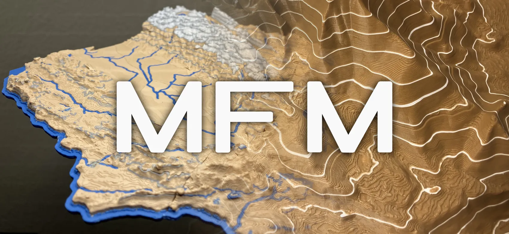

# 3D G-code Map Feature Modifier (MFM)

Add colored [isolines (contour lines/elevation lines)](https://en.wikipedia.org/wiki/Contour_line) and recolor [elevation ranges](https://desktop.arcgis.com/en/arcmap/latest/map/styles-and-symbols/working-with-color-ramps.htm) to [3D printable map models](https://ansonliu.com/maps/). **3D G-code Map Feature Modifier (MFM)** is a G-code Post Processor made for 3D topo map models but any 3D model can be recolored with 2 additional colors.

[Download the latest version of MFM](https://github.com/ansonl/mfm/releases)!

MFM adds additional features to the model by post processing sliced [3D printer G-code](https://marlinfw.org/meta/gcode/). 3D models and printing g-code can be recolored at either layer or individual feature/line level granularity.

- **Feature/Line Type Scoping** - Recoloring can be set to only affect specific printing feature/line types. *Only want to recolor top surfaces or walls at certain heights? Do it with MFM!*

- **G-code Feature Print Order Optimization** - Printed features are rearranged for faster, more consistent prints. Nozzle pressure is maintained and the number of toolchanges is decreased.

- **Wipe/Coasting Compensation** - Existing Wipe/Coasting flow compensation generated by the slicer is retained even when g-code features are relocated.

- **Prime Tower Compatible** - Existing Prime Towers are reused for optimal filament flow and color flushing. *No prime tower or large prime tower? I don't judge. Both configurations are supported.*

- **Slicer Compatibility** - Tested to be compatible with PrusaSlicer and Bambu Studio.

If you find this tool helpful, please leave feedback and consider supporting my development and 3D modeling with a [Printables](https://www.printables.com/@ansonl) "club membership" or [Paypal](https://paypal.me/0x80).

My 3D topo and other models are on [MakerWorld](https://makerworld.com/en/@ansonl) and [Printables](https://www.printables.com/@ansonl).

## Current G-code flavors supported

- Marlin 2 ([PrusaSlicer](https://github.com/prusa3d/PrusaSlicer)/[Bambu Studio](https://github.com/bambulab/BambuStudio))

Your slicer **must generate g-code with [Relative Extrusion](https://www.ideamaker.io/dictionaryDetail.html?name=Relative%20Extrusion&category_name=Printer%20Settings)**. PrusaSlicer and Bambu Studio default to relative extrusion. Cura defaults to absolute extrusion and relative extrusion must be explicitly enabled.

| Slicer | Tested Version |
| --- | --- |
| PrusaSlicer | 2.7.1 |
| Bambu Studio | 1.8.2.56 |
| Cura | Looking for testers |

If you would like support for your printer or slicer G-code flavor to be added, please open an issue and if you are able to test the G-code on your printer.

## Getting Started

Set up your slicer and printer for MFM by following the steps on each page below:

1. [Slicer Setup](slicer-setup.md)

2. [Configuration](configuration-setup.md)

3. [Minimal Toolchange G-code](minimal-toolchange-gcode.md)

After following all three above setup pages, download the [latest release of MFM](https://github.com/ansonl/mfm/releases) and run `MFM.exe` to start MFM.

1. Select the import G-code file that was saved from your slicer

2. Select the configuration JSON file that you customized.

3. Select the toolchange G-code file for your printer.

4. Check if the export G-code file location looks right

5. Press *Post Process*

> If a release of MFM has not been built for your OS, you can [download](https://github.com/ansonl/mfm/archive/refs/heads/master.zip) this repo, navigate to it in the command line and run `python src/gui.py`.

## Frequent Issues

| 🚧 Issue | Solution |
| --- | --- |
| How do I convert a 3D model into G-code for printing? | After importing and slicing your model in a slicer software, export the 3D printer commands as [ASCII] G-code. MFM can be process and recolor this saved G-code file. |
| How do I printer my G-code file? | Put the G-code file exported by MFM on an SD card or transfer the G-code file to your printer over the network. Bambu printer users can use [FTPS](https://forum.bambulab.com/t/we-can-now-connect-to-ftp-on-the-p1-and-a1-series/6464) for wireless transfer. |
| MFM did not add or change any colors. | Setup your slicer for MFM through [Slicer Setup](slicer-setup.md) |
| How can MFM recoloring be customized? | Read [Configuration](configuration-setup.md) for details. |
| How can MFM be used with a material other than PLA and customized toolchange? | See [Minimal Toolchange G-code](minimal-toolchange-gcode.md) on recommendations on how to setup your own toolchange. I may add an option to set toolchange temperatures based on material in the future. Open an issue with your use cases. |
| Incorrect color was printed even though previewing the exported G-code in the slicer shows the correct color slots being used. | Assign a different filament to each slot in the Bambu AMS. Every slot with a different color **must have a different color assigned** in AMS. Otherwise Bambu AMS [Autoswitch](https://forum.bambulab.com/t/automatic-material-switch-over/4189) feature may try to use a single slot's filament for a shared material and color between multiple slots. |
| Mixed OS line endings in the same file will lead to G-code errors. MFM tries to auto detect the line ending used with first line ending found. | Select the correct line ending of your G-code instead of auto detect. Either convert the entire G-code file with Unix line endings to Windows line endings before post processing or generate the G-code on Windows. [Python on Windows does not handle Unix line endings correctly.](https://stackoverflow.com/questions/15934950/python-file-tell-giving-strange-numbers) |
| Only one isoline interval and/or colored elevation range can be set. | Only one of each is exposed at the moment. The implementation could support more in the future if there is a use case. |
| Support and Bridge features are not explicitly prioritized to pprint first.  | I could prioritize printing certain features first in the future. Open an issue with your use cases for this. |

## Bug Reports

Open an issue on Github. Please note the OS, Slicer, printer, and provide the 3D model, MFM configuration JSON, before/after G-code, and any console logs.

## License and Disclaimer

GNU AFFERO GENERAL PUBLIC LICENSE v3.0

Copyright © 2023 Anson Liu

THE SOFTWARE IS PROVIDED “AS IS”, WITHOUT WARRANTY OF ANY KIND, EXPRESS OR IMPLIED, INCLUDING BUT NOT LIMITED TO THE WARRANTIES OF MERCHANTABILITY, FITNESS FOR A PARTICULAR PURPOSE AND NONINFRINGEMENT. IN NO EVENT SHALL THE AUTHORS OR COPYRIGHT HOLDERS BE LIABLE FOR ANY CLAIM, DAMAGES OR OTHER LIABILITY, WHETHER IN AN ACTION OF CONTRACT, TORT OR OTHERWISE, ARISING FROM, OUT OF OR IN CONNECTION WITH THE SOFTWARE OR THE USE OR OTHER DEALINGS IN THE SOFTWARE.
