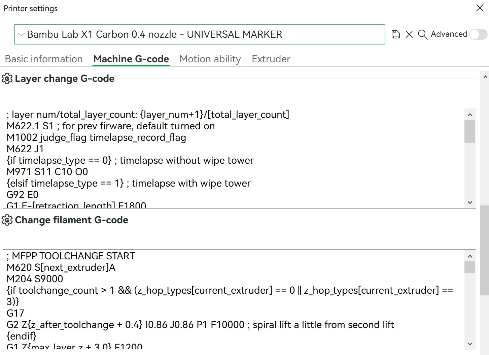

# Slicer Setup for MFM

## G-code coordinate positioning mode

All printing G-code must use [Relative Positioning for Extrusion](https://www.ideamaker.io/dictionaryDetail.html?name=Relative%20Extrusion&category_name=Printer%20Settings).

Printhead XYZE absolution positioning can be set with `G91` and only the Extruder (E) can be set to relative positioning with `M83`. If too little/too much filament is extruded, your extrusion positioning may be set to absolute in the slicer.

## Set Printer G-code

Add markers in your slicer software G-code for the end of new layer change and start and end of toolchange.

Save the printer profile with a new name and select the new printer profile for your prints.



### PrusaSlicer / BambuStudio steps

1. Printer > Settings > **Custom G-code / Machine G-code**

2. Add `; MFM LAYER CHANGE END` on a new line at the end of **After layer change G-code / Layer change G-code**.

3. Add `; MFM TOOLCHANGE START`  on a new line at the beginning of **Tool change G-code / Change filament G-code**.

4. Add `; MFM TOOLCHANGE END`  on a new line at the end of **Tool change G-code / Change filament G-code**.

5. The resulting settings text fields should have an order like below

#### After layer change G-code

```gcode
; Existing layer change G-code stays HERE

; MFM LAYER CHANGE END
```

#### Tool change G-code

```gcode
; MFM TOOLCHANGE START

; Existing toolchange G-code stays HERE

; MFM TOOLCHANGE END
```

## Set Filament Settings

### Disable `Long retraction when cut` (Bambu Studio)

Bambu Slicer has a conditional section in the toolchange that uses a proprietary G-code `M620.11` to perform a longer retraction before cutting filament. This command requires the previous extruder index for an unknown purpose. 

I assume that this previous extruder index is used to retract the previous extruder index filament feeder inside the AMS due to the new longer retraction distance being greater than what the filament buffer was initially designed to buffer. 

```gcode
{if long_retractions_when_cut[previous_extruder]}
M620.11 S1 I[previous_extruder] E-{retraction_distances_when_cut[previous_extruder]} F{old_filament_e_feedrate}
{else}
M620.11 S0
{endif}
```

For every filament used:

1. Filament > **Setting Overrides**
2. Uncheck `Long retraction when cut`
